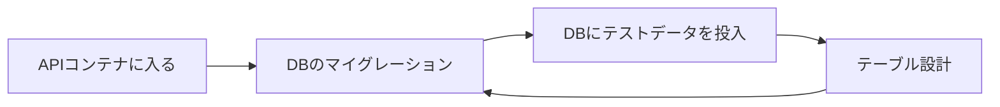

# traning-template

研修テンプレート

## 使用言語・フレームワーク

front, api の`README.md`参照

## Tips

- vscode でファイルを開くときには、「Cmd + P > 開きたいファイル名」のショートカットだと生産性が高いのでおすすめ

## DB

-[テーブル設計](db/docs/dbdoc/README.md)

## 全体

```
$ git clone ***
$ cd ***
$ docker-compose up -d --build
$ docker ps // コンテナを確認
CONTAINER ID   IMAGE                    COMMAND                  CREATED          STATUS          PORTS                               NAMES
396db30c4892   traning-template_api     "air"                    24 minutes ago   Up 24 minutes   0.0.0.0:8080->8080/tcp              go-api-container
04b4e8bde261   mysql:5.7                "docker-entrypoint.s…"   24 minutes ago   Up 24 minutes   33060/tcp, 0.0.0.0:3400->3306/tcp   traning-template_db_1
2f4e3a7170a9   stoplight/prism:4        "node dist/index.js …"   24 minutes ago   Up 24 minutes   0.0.0.0:4010->4010/tcp              traning-template_prism_1
efe6144c2864   traning-template_front   "docker-entrypoint.s…"   24 minutes ago   Up 24 minutes   0.0.0.0:5173->5173/tcp              vue-front-container
```

## front

### 開発手順

1. build

```sh
$ docker-compose exec front /bin/bash
$ yarn
$ yarn run dev --host
```

2. 確認  
   ブラウザで以下を確認し、動作していることを確認します  
   http://localhost:5173/

3. 開発を始める  
   さあ、スタートです！

## api

### 開発手順

1. migration, テストデータ投入



コマンドを以下に示す

```sh
$ docker-compose exec api /bin/bash
$ sql-migrate up
$ go run migrations/sample_users_seed.go
```

2. echo が動作しているか確認  
   `docker ps`で api コンテナが動作していることを確認したり、`Docker Desktop`で log を確認する、  
   curl で確認などして、動作していることを確認します

(例) curl で確認した時のレスポンス  
※ api は未実装なので、以下のレスポンスとなっています

```
ohbay@SRC-NPC-MAC-054 traning-template % curl http://localhost:8080/ | jq
  % Total    % Received % Xferd  Average Speed   Time    Time     Time  Current
                                 Dload  Upload   Total   Spent    Left  Speed
100    24  100    24    0     0    408      0 --:--:-- --:--:-- --:--:--   452
{
  "message": "Not Found"
}
```

3. 開発を始める  
   さあ、スタートです！

## mysql

### 開発手順

注意::migration、および、テストデータの投入を先に行わないとテーブルがない状態になります

> [!TIP]
>
> ### パスワードの見つけ方（ヒント）
>
> このリポジトリは、Docker を使用して SQL サーバーのコンテナを構築しています
>
> では、Docker の、どのファイルで、どんな SQL サーバーのコンテナを構築するか設定しているか確認してみましょう

```sh
$ docker-compose exec db /bin/bash
$ mysql -uroot -p
$ {パスワードを入力する}
mysql> use dev;
mysql> show tables;
mysql> select * from users; // migration、および、seedの投入を実施している場合
+---------+-----------+
| user_id | user_name |
+---------+-----------+
| user1   | hogehoge  |
+---------+-----------+
```

## [prism](https://qiita.com/andynuma/items/bf043b5184d3826d0f92)

### 開発手順

swagger.yml を mock サーバーとして活用できるようになるものです。  
初期状態として、`users`という API の記載例を示していて、swagger.yml を編集すると、その修正が反映されます

API レスポンスを確認したい場合は、任意の REST クライアントツール（Postman など）や、ブラウザ、curl などで確認が可能

(例) : http://localhost:4010/users をブラウザで確認した時のレスポンス

```
[{"id":"248c8027-b752-db4c-76c1-fb22a05e9591","name":"田中太郎","address":"東京都中央区新富1-16-4","birthday":"1990-01-01","age":33,"sex":"MALE","memberType":"GENERAL"},{"id":"a980e372-1eb2-0e1a-f23b-9208e226e954","name":"山田花子","address":"埼玉県さいたま市大宮区桜木町1-7-5","birthday":"1988-10-15","age":34,"sex":"FEMALE","memberType":"SENIOR"},{"id":"a9bbaab7-f596-712f-b4cf-c72a4323dff2","name":"山本次郎","address":"神奈川県横浜市中区横浜公園","birthday":null,"age":null,"sex":"MALE","memberType":null}]
```

(例) : http://localhost:4010/users を curl で確認した時のレスポンス

```
ohbay@SRC-NPC-MAC-054 traning-template % curl http://localhost:4010/users | jq
  % Total    % Received % Xferd  Average Speed   Time    Time     Time  Current
                                 Dload  Upload   Total   Spent    Left  Speed
100   557  100   557    0     0    385      0  0:00:01  0:00:01 --:--:--   387
[
  {
    "id": "248c8027-b752-db4c-76c1-fb22a05e9591",
    "name": "田中太郎",
    "address": "東京都中央区新富1-16-4",
    "birthday": "1990-01-01",
    "age": 33,
    "sex": "MALE",
    "memberType": "GENERAL"
  },
  {
    "id": "a980e372-1eb2-0e1a-f23b-9208e226e954",
    "name": "山田花子",
    "address": "埼玉県さいたま市大宮区桜木町1-7-5",
    "birthday": "1988-10-15",
    "age": 34,
    "sex": "FEMALE",
    "memberType": "SENIOR"
  },
  {
    "id": "a9bbaab7-f596-712f-b4cf-c72a4323dff2",
    "name": "山本次郎",
    "address": "神奈川県横浜市中区横浜公園",
    "birthday": null,
    "age": null,
    "sex": "MALE",
    "memberType": null
  }
]
```
