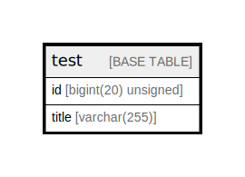

# test

## Description

<details>
<summary><strong>Table Definition</strong></summary>

```sql
CREATE TABLE `test` (
  `id` bigint(20) unsigned NOT NULL AUTO_INCREMENT,
  `title` varchar(255) NOT NULL,
  PRIMARY KEY (`id`),
  UNIQUE KEY `id` (`id`)
) ENGINE=InnoDB DEFAULT CHARSET=utf8
```

</details>

## Columns

| Name | Type | Default | Nullable | Extra Definition | Children | Parents | Comment |
| ---- | ---- | ------- | -------- | ---------------- | -------- | ------- | ------- |
| id | bigint(20) unsigned |  | false | auto_increment |  |  |  |
| title | varchar(255) |  | false |  |  |  |  |

## Viewpoints

| Name | Definition |
| ---- | ---------- |
| [サンプル](viewpoint-0.md) | 外部応札システム（クラウド）システムを 実現するためのテーブル構成を示す |

## Constraints

| Name | Type | Definition |
| ---- | ---- | ---------- |
| id | UNIQUE | UNIQUE KEY id (id) |
| PRIMARY | PRIMARY KEY | PRIMARY KEY (id) |

## Indexes

| Name | Definition |
| ---- | ---------- |
| PRIMARY | PRIMARY KEY (id) USING BTREE |
| id | UNIQUE KEY id (id) USING BTREE |

## Relations



---

> Generated by [tbls](https://github.com/k1LoW/tbls)
