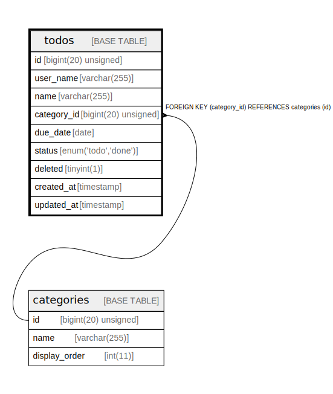

# todos

## Description

<details>
<summary><strong>Table Definition</strong></summary>

```sql
CREATE TABLE `todos` (
  `id` bigint(20) unsigned NOT NULL AUTO_INCREMENT,
  `user_name` varchar(255) NOT NULL,
  `name` varchar(255) NOT NULL,
  `category_id` bigint(20) unsigned DEFAULT NULL,
  `due_date` date DEFAULT NULL,
  `status` enum('todo','done') NOT NULL,
  `deleted` tinyint(1) DEFAULT NULL,
  `created_at` timestamp NOT NULL DEFAULT CURRENT_TIMESTAMP,
  `updated_at` timestamp NOT NULL DEFAULT CURRENT_TIMESTAMP,
  PRIMARY KEY (`id`,`user_name`),
  UNIQUE KEY `id` (`id`),
  KEY `category_id` (`category_id`),
  CONSTRAINT `todos_ibfk_1` FOREIGN KEY (`category_id`) REFERENCES `categories` (`id`) ON DELETE CASCADE
) ENGINE=InnoDB DEFAULT CHARSET=utf8
```

</details>

## Columns

| Name | Type | Default | Nullable | Extra Definition | Children | Parents | Comment |
| ---- | ---- | ------- | -------- | ---------------- | -------- | ------- | ------- |
| id | bigint(20) unsigned |  | false | auto_increment |  |  |  |
| user_name | varchar(255) |  | false |  |  |  |  |
| name | varchar(255) |  | false |  |  |  |  |
| category_id | bigint(20) unsigned |  | true |  |  | [categories](categories.md) |  |
| due_date | date |  | true |  |  |  |  |
| status | enum('todo','done') |  | false |  |  |  |  |
| deleted | tinyint(1) |  | true |  |  |  |  |
| created_at | timestamp | CURRENT_TIMESTAMP | false |  |  |  |  |
| updated_at | timestamp | CURRENT_TIMESTAMP | false |  |  |  |  |

## Viewpoints

| Name | Definition |
| ---- | ---------- |
| [サンプル](viewpoint-0.md) | 外部応札システム（クラウド）システムを 実現するためのテーブル構成を示す |

## Constraints

| Name | Type | Definition |
| ---- | ---- | ---------- |
| id | UNIQUE | UNIQUE KEY id (id) |
| PRIMARY | PRIMARY KEY | PRIMARY KEY (id, user_name) |
| todos_ibfk_1 | FOREIGN KEY | FOREIGN KEY (category_id) REFERENCES categories (id) |

## Indexes

| Name | Definition |
| ---- | ---------- |
| category_id | KEY category_id (category_id) USING BTREE |
| PRIMARY | PRIMARY KEY (id, user_name) USING BTREE |
| id | UNIQUE KEY id (id) USING BTREE |

## Relations



---

> Generated by [tbls](https://github.com/k1LoW/tbls)
