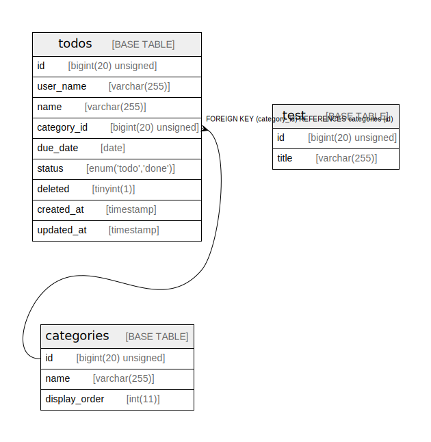

# サンプル

## Description

外部応札システム（クラウド）システムを 実現するためのテーブル構成を示す

## Tables

| Name | Columns | Comment | Type |
| ---- | ------- | ------- | ---- |
| [categories](categories.md) | 3 |  | BASE TABLE |
| [test](test.md) | 2 |  | BASE TABLE |
| [todos](todos.md) | 9 |  | BASE TABLE |

## Relations

---

> Generated by [tbls](https://github.com/k1LoW/tbls)
